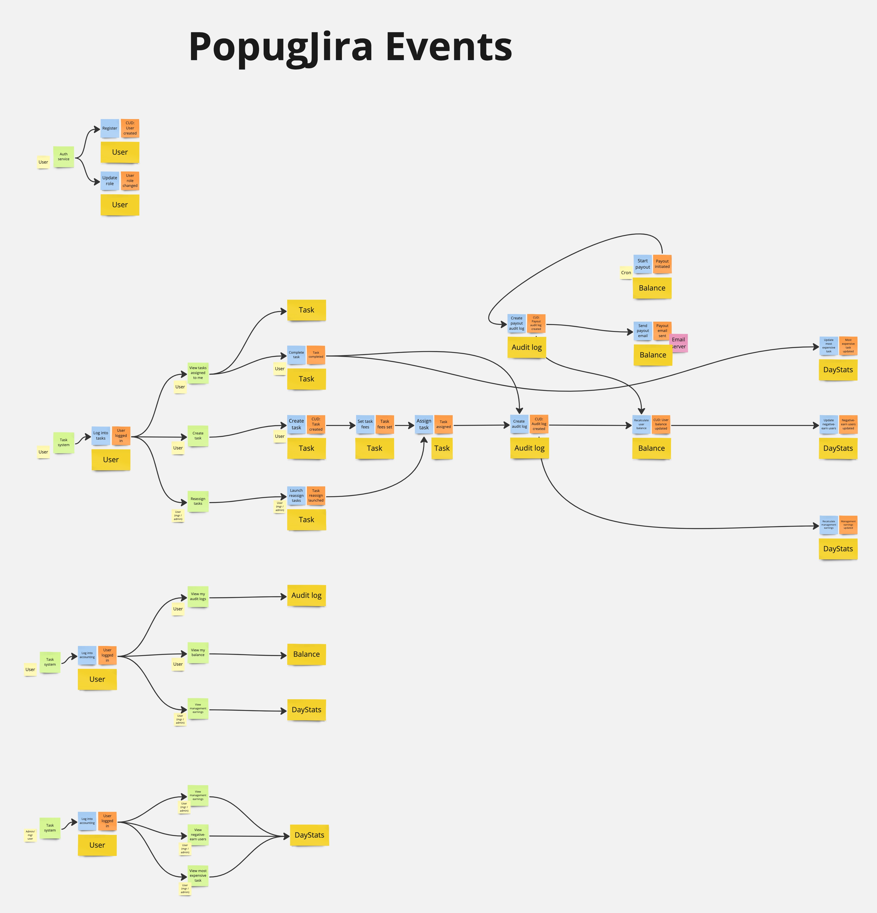
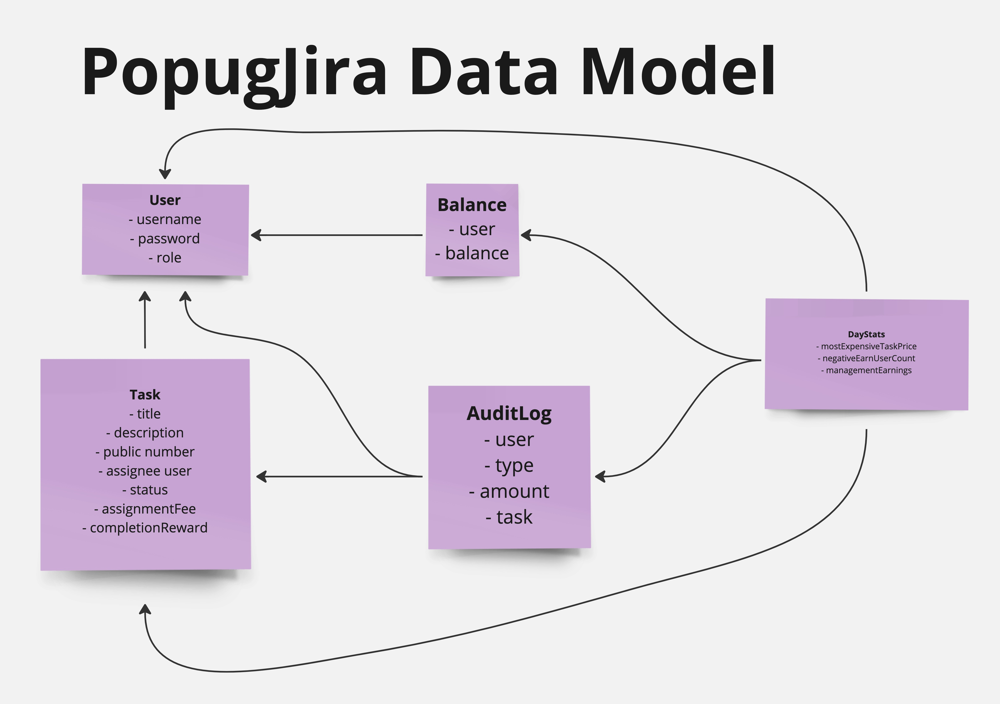
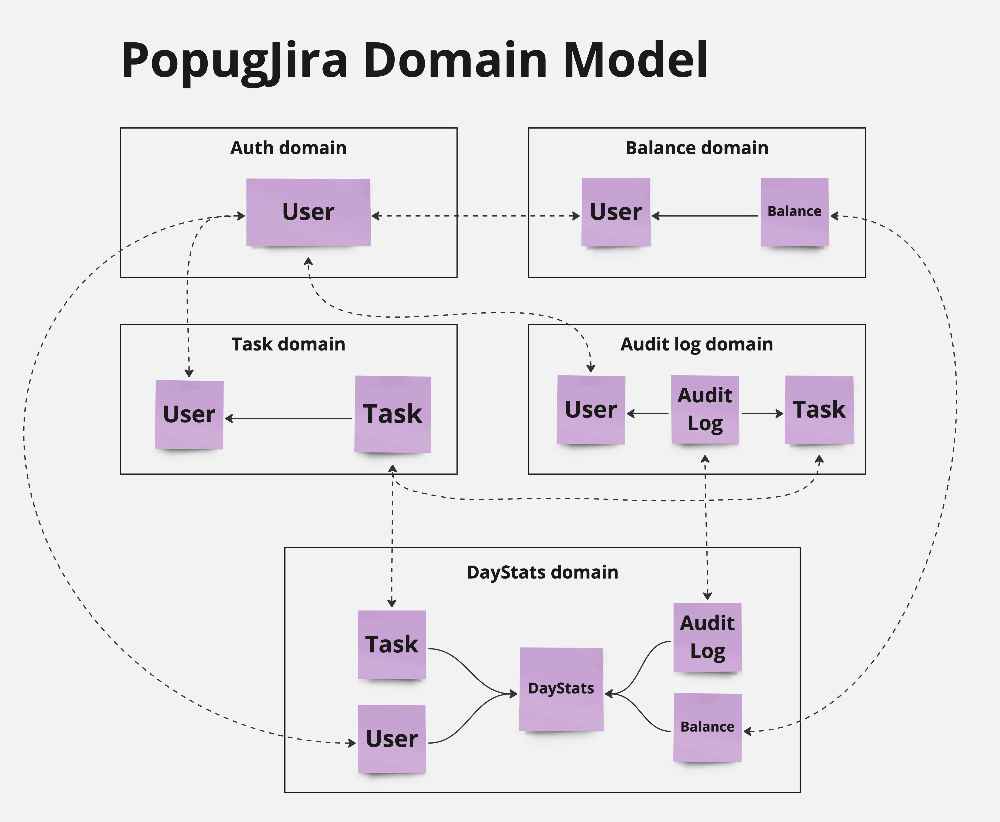
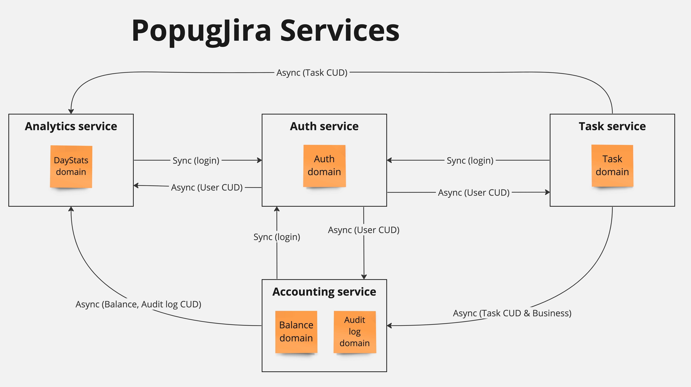

# Проектирование PopugJira

## События и бизнес-цепочки

[hi-res](PopugJira_Events.jpg)

## Модель данных

[hi-res](PopugJira_Data_Model.jpg)

## Модель доменов

[hi-res](PopugJira_Domain_Model.jpg)

## Сервисы

[hi-res](PopugJira_Services.jpg)

## Бизнес-события
| Event                  | Producer service | Consumer services           |
|------------------------|------------------|-----------------------------|
| User role changed      | Auth             | Task, Analytics, Accounting |
| Task fees set          | Task             | Task, Analytics, Accounting |
| Task assigned          | Task             | Accounting, Analytics       |
| Task reassign launched | Task             | Task                        |
| Task completed         | Task             | Accounting, Analytics       |
| Payout initiated       | Accounting       | Accounting                  |

## CUD-события
| Event                    | Data                              | Producer service | Consumer services           |
|--------------------------|-----------------------------------|------------------|-----------------------------|
| User Created             | username role                     | Auth             | Task, Analytics, Accounting |
| Task Created             | title, description, public number | Task             | Task, Analytics, Accounting |
| Task Audit Log Created   | user, type, amount, task          | Accounting       | Accounting, Analytics       |
| Payout Audit Log Created | user, type, amount                | Accounting       | Accounting, Analytics       |
| Balance Updated          | user, balance                     | Accounting       | Analytics                   |

