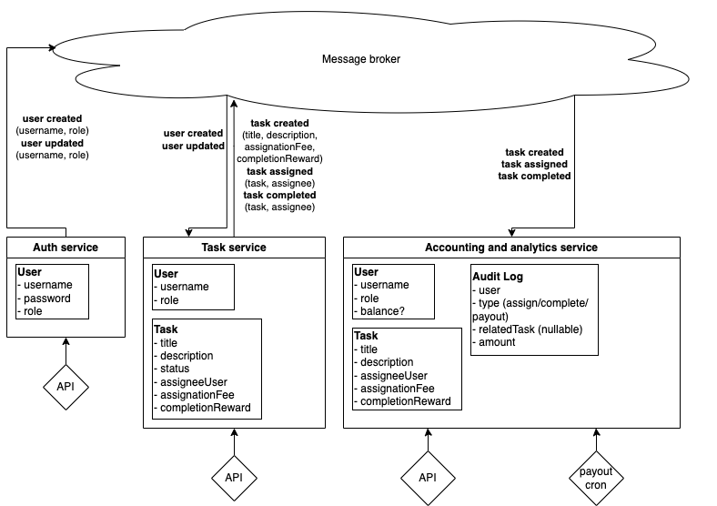

# Awesome Task Exchange System

## Схема

## Описание сервисов

В системе будет три сервиса: сервис авторизации, сервис тасок и сервис аккаунтинга/аналитики.

Сервис авторизации изолирован от остального мира: он отвечает за создание/изменение аккаунтов и их авторизацию. Будет выдавать JWT, которые другие сервисы сами смогут заверифаить. Возможные изменения аккаунтов - это только изменения роли и пароля.

Сервис тасок отвечает за создание, ассайн и изменение статусов задач. В этой имплементации цены за ассайн и выполнение задачи также относятся к области ответственности сервиса тасок. Это сделано потому, что на мой взгляд сервис тасок больше подходит на роль владельца этой информации.

Аккаунтинга и аналитика обьединена в один сервис, так как по сути оперирует одними и теми же данными. Для этого сервиса есть два энтрипоинта: API и cron job.
